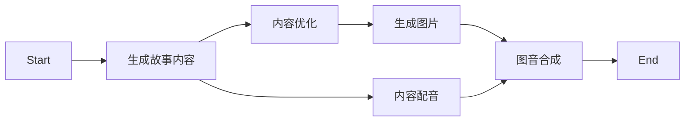

# Bedtime_story

> 一键生成睡前故事视频

注意：该程序调用了 `ChatGLM` 与 `Stable Diffusion WebUI` 的 `API`，请提前准备。

## 流程图



## 使用方式

下载本仓库：

```shell
git clone https://github.com/danielchan-25/bedtime_story.git
cd bedtime_story
```

然后使用 `pip` 安装依赖：

```shell
# 推荐使用 python 版本：3.9.6
pip install -r requirements.txt
```

执行程序：

```shell
python run.py
```

## 配置
见 `config.ini`

## 引用

> ChatGLM2-6B -  https://github.com/THUDM/ChatGLM2-6B
>
> Stable Diffusion WebUI - https://github.com/AUTOMATIC1111/stable-diffusion-webui
>
> Edge-TTS - https://github.com/rany2/edge-tts
>
> FFmpeg - https://github.com/FFmpeg/FFmpeg


